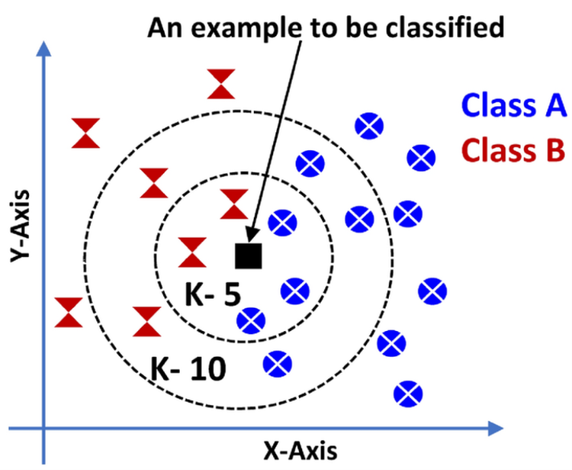

## K-Nearest Neighbor (KNN)
### KNN can be used for both classification and regression.
### For classification tasks, there has to be labelled data. and our goal is to predict, to which class new data point falls.

## Algorithm:
### 1. Calculate euclidean distance for the new datapoint with all other datapoints in the dataset.
### 2. Sort distances in ascending order.
### 3. Choose first `K` datapoints.
### 4. Among, first `K` datapoints, class with highest freqency is assigned as class to the new datapoint.

## Advantages:
### --> This is just a simple distance calculating mathematics.

## Disadvantages:
### --> Since, distance has to be calculated with all the datapoints in the dataset in inferencing time, which is computationally expensive.

## Visualization: 

## Explanation:
### In this image, value of `K` is choosen as `5`, so when a new datapoint is to be classified, its distance is calculated to all other datapoints and arranged in ascending order. then, first 5 samples are selected, here, `#. of class A=3` and `#. of class B=2`. 
### frequency of `class A` is higher so, the new datapoint is classified as `class A` element.